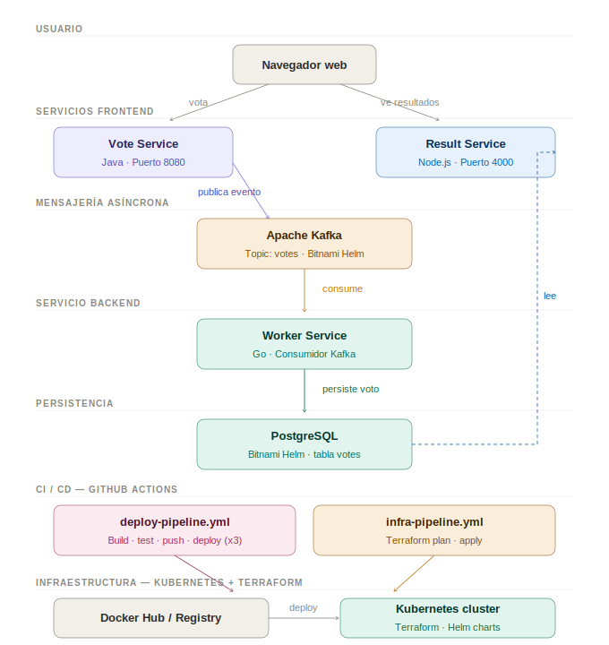

# Microservices Demo

Aplicación de votación distribuida construida con microservicios, utilizada como base para el **Taller 1 — Construcción de pipelines en Cloud**.

> Proyecto original: [okteto/microservices-demo](https://github.com/okteto/microservices-demo)  
> Metodología ágil: **Scrum**

---

## Arquitectura



El sistema permite a los usuarios votar entre dos opciones (Tacos vs Burritos) y ver los resultados en tiempo real. Está compuesto por cinco componentes principales:

| Servicio | Tecnología | Rol |
|---|---|---|
| `vote/` | Java · Puerto 8080 | Frontend de votación — publica eventos a Kafka |
| `worker/` | Go | Consumidor Kafka — persiste votos en PostgreSQL |
| `result/` | Node.js · Puerto 4000 | Frontend de resultados — lee de PostgreSQL en tiempo real |
| Kafka | Apache Kafka (Bitnami Helm) | Broker de mensajes asíncrono |
| PostgreSQL | PostgreSQL (Bitnami Helm) | Base de datos de resultados |

---

## Documentación

| Documento | Descripción |
|---|---|
| [Estrategia de branching](docs/branching-strategy.md) | GitHub Flow (desarrollo) y Environment Branching (operaciones) |
| [Patrones de diseño en la nube](docs/cloud-design-patterns.md) | Event-Driven Messaging y Sidecar Pattern |
| [Pipelines CI/CD](docs/pipelines.md) | Descripción de deploy-pipeline.yml e infra-pipeline.yml |

---

## Pipelines CI/CD

El proyecto utiliza **GitHub Actions** con dos workflows en `.github/workflows/`:

### `deploy-pipeline.yml`
Se activa con cada push o PR a `main`. Construye, testea y despliega los tres microservicios al cluster de Kubernetes.

### `infra-pipeline.yml`
Se activa con cambios en la rama de infraestructura. Ejecuta `terraform plan` y `terraform apply` para provisionar y actualizar el cluster.

---

## Infraestructura

La infraestructura está definida como código en la carpeta `/terraform` y se despliega sobre **Kubernetes** usando **Helm charts** de Bitnami para Kafka y PostgreSQL.

```
infrastructure/   # Manifiestos de Kubernetes (Helm values)
terraform/        # Definición de infraestructura como código
```

---

## Estrategia de branching

**Desarrollo — GitHub Flow:**
```
main ◀── PR ◀── feature/nombre-funcionalidad
```

**Operaciones — Environment Branching:**
```
develop ──PR──▶ staging ──PR──▶ main
```

---

## Correr localmente

```bash
git clone https://github.com/juancasanov/microservices-demo
cd microservices-demo
okteto login
okteto deploy
```

### Desarrollar en un microservicio específico

```bash
# Vote service
okteto up vote

# Result service  
okteto up result

# Worker service
okteto up worker
make start
```

---

## Notas

- La aplicación acepta un solo voto por cliente.
- Kafka y PostgreSQL se despliegan via Helm charts de Bitnami.
- Los pipelines requieren los secrets `DOCKER_USERNAME` y `DOCKER_PASSWORD` configurados en GitHub.
